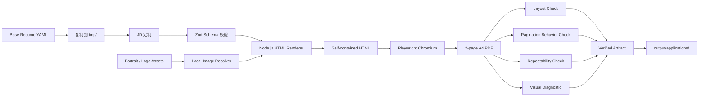

# Resume Generator

> 面向 JD 定制场景的可验证、可复现简历生成系统。

Resume Generator 使用结构化 YAML 管理简历内容，通过 Zod 做严格数据校验，在 Node.js 中生成自包含 HTML，再交给 Playwright Chromium 渲染为两页 A4 PDF。生成过程同时经过设计锁、布局检查、真实分页行为回归、像素级重复性检查和视觉对照，目标不是简单“把内容导出成 PDF”，而是**让每一次简历生成都具备明确输入、稳定输出和可验证结果**。

## 为什么做这个项目

实际求职中的简历定制，往往不是“换一份模板”这么简单。不同 JD 会带来内容增删、项目排序和文字长度变化，如果排版依赖人工分页、固定页码或手工微调，很容易出现：

- 内容变化后分页失控，第一页留下大面积空白；
- 为某一份简历写特殊分页规则，下一份简历再次失效；
- 同一输入重复生成得到不同结果，难以做可靠回归；
- 修改 CSS 后缺少明确的视觉基线，排版漂移不容易被发现；
- 多份 Base 或多个生成任务复用同一输出文件，产生覆盖、旧产物误读或 Windows 文件锁问题。

本项目把这些问题放在同一条生成链路里处理：**内容与布局分离、自动分页、确定性渲染、行为级验证、设计基线锁定和安全产物发布**。

## 核心能力

- **结构化简历数据**：使用 YAML 描述教育、技能、实习、项目和个人信息，Zod `strictObject` 拒绝未知字段和旧人工分页字段。
- **Base + JD 工作副本**：`data/` 保存经过确认的 Base Resume；针对具体岗位时复制到 `tmp/` 修改，避免日常定制污染基线。
- **自动分页**：输出一个连续文档流，由 Chromium CSS Fragmentation 根据真实内容决定分页，不在 YAML 中保存页码、断点或 `page2BulletStart` 一类人工分页信息。
- **行为级分页回归**：使用真实 Chromium PDF 和 synthetic fixtures 验证项目可在 bullet 边界自然跨页、单条 bullet 不被拆断、section title 不孤立。
- **设计锁**：`design-lock.json` 对 `template/resume.html` 和 `styles/resume.css` 保存 SHA-256 基线；未经明确批准的模板变化会被阻止。
- **确定性输出**：同一输入连续渲染两次，逐页栅格化后比较 SHA-256，验证像素级重复性。
- **布局检查**：检测元素越界、重叠、异常间距，并校验 Header、正文流和图片槽位的几何关系。
- **本地图片资产**：头像和 Header Logo 使用统一的本地图片解析流程，支持 PNG、JPEG、WebP、SVG，并内联为 Data URI，生成 HTML 不依赖运行时网络资源。
- **产物隔离**：不同 `meta.profile` 默认生成独立 PDF / HTML / report；repeatability 使用独立临时目录，不再依赖正式 PDF。
- **安全发布**：构建先写入唯一 staging 文件，验证成功后再发布到目标路径；如果 Windows 下目标 PDF 正被阅读器占用，会保留旧文件并明确失败，不会用旧产物冒充本次结果。
- **申请文件归档**：`generate` 在完整验证通过后，将最终 PDF 写入 `output/applications/`，文件名包含日期、姓名、公司和岗位，并自动避免覆盖同名历史文件。

## 工作流程



## 快速开始

### 1. 环境要求

- Node.js `>= 22`
- Python 3
- npm
- Poppler 命令行工具
  - `pdfinfo`：PDF 页数检查
  - `pdftotext` 或 `pdftoppm`：分页行为检查
- Chromium
  - Windows / macOS：默认使用 Playwright 管理的 Chromium
  - Linux：默认使用 `/usr/bin/chromium`，也可通过 `CHROMIUM_EXECUTABLE` 指定

### 2. 安装依赖

```bash
npm ci
```

创建 Python 虚拟环境并安装依赖。

Windows PowerShell：

```powershell
python -m venv .venv
.\.venv\Scripts\python -m pip install -r requirements.txt
.\.venv\Scripts\python -m playwright install chromium
```

macOS / Linux：

```bash
python3 -m venv .venv
./.venv/bin/python -m pip install -r requirements.txt
./.venv/bin/python -m playwright install chromium
```

> Linux 默认渲染路径使用 `/usr/bin/chromium`。如果系统 Chromium 位于其他路径，请设置 `CHROMIUM_EXECUTABLE`。

### 3. 验证基础环境

```bash
npm test
npm run build:resume -- --input data/base-fintech.yaml
```

成功后默认生成：

```text
output/resume-fintech.pdf
output/resume-fintech.html
output/build-report-fintech.json
```

## 从 Base 生成一份岗位定制简历

日常 JD 定制不要直接修改 `data/base-fintech.yaml` 或 `data/base-fullstack.yaml`。

Windows PowerShell：

```powershell
New-Item -ItemType Directory -Force tmp | Out-Null
Copy-Item data/base-fintech.yaml tmp/my-resume.yaml
```

macOS / Linux：

```bash
mkdir -p tmp
cp data/base-fintech.yaml tmp/my-resume.yaml
```

编辑：

```text
tmp/my-resume.yaml
```

完成内容调整后先执行完整验证：

```bash
npm run verify:resume -- --input tmp/my-resume.yaml
```

然后生成正式申请文件：

```bash
npm run generate -- --input tmp/my-resume.yaml --company 示例公司 --role 后端工程师
```

生成结果会进入：

```text
output/applications/YYYYMMDD-姓名-公司-岗位.pdf
```

如果同名文件已经存在，会自动追加 `-02`、`-03` 等后缀，避免覆盖已有申请记录。

## Base Resume

当前仓库维护两份独立 Base：

| 文件 | `meta.profile` | 用途 |
| --- | --- | --- |
| `data/base-fintech.yaml` | `fintech` | 金融科技 / 后端 / 运维等方向 |
| `data/base-fullstack.yaml` | `fullstack` | 全栈 / Web 开发方向 |

默认构建命令：

```bash
npm run build:resume
```

等价于：

```bash
npm run build:resume -- --input data/base-fintech.yaml
```

不同 profile 会生成独立产物：

```text
output/resume-fintech.pdf
output/resume-fullstack.pdf
```

对应 HTML 和 build report 同样按 profile 隔离。

## YAML 配置

简历输入由 `scripts/resume-schema.ts` 做严格校验，核心数据包括：

- `meta`
- `profile`
- `education`
- `skills`
- `internships`
- `projects`

个人图片示例：

```yaml
profile:
  name: LIANDONGJIE
  portrait: assets/portrait.png
  headerLogo: assets/logos/nju.svg
```

其中：

- `portrait` 为必填图片；
- `headerLogo` 为可选图片；
- 图片必须位于项目目录内；
- 支持 `.png`、`.jpg`、`.jpeg`、`.webp`、`.svg`；
- 图片内容会在构建时内联为 Data URI。

文本字段支持一种安全的行内强调语法：

```text
将 P95 延迟由 **8.7s 降至 1.5s**
```

`**text**` 会在 HTML 转义之后渲染为 `<strong>`；原始 HTML 不会被直接解释。

## 自动分页

分页是本项目的核心约束之一。

Resume YAML **不包含**任何页码、分页断点或“从第几条 bullet 开始第二页”的人工提示。`build.ts` 始终生成一个连续 `.resume-flow`，分页由 Chromium 根据：

- `@page`
- `break-inside`
- `break-before`
- `break-after`

结合真实内容高度决定。

当前策略包括：

- section title 避免孤立在页尾；
- project 允许跨页；
- project 可以在 bullet 边界自然分割；
- 单条 bullet 保持完整，不从中间硬拆；
- 不针对某一个真实项目、某一份 Base 或某个固定页码写特殊规则。

分页正确性不是通过“检查 CSS 字符串”来证明，而是通过 `tests/fixtures/` 中的 synthetic boundary cases 生成真实 Chromium PDF，再验证 token 的实际页分配。

手动执行分页检查：

```bash
node --experimental-strip-types scripts/check-pagination.ts \
  --html output/resume-fintech.html \
  --pdf output/resume-fintech.pdf
```

Windows PowerShell 可写成一行：

```powershell
node --experimental-strip-types scripts/check-pagination.ts --html output/resume-fintech.html --pdf output/resume-fintech.pdf
```

## 验证体系

`verify:resume` 会按固定顺序执行完整质量检查：

1. 单元测试
2. Design Lock
3. Schema 校验
4. 构建 HTML / PDF
5. Layout Check
6. Pagination Behavior Check
7. Repeatability Check
8. Visual Diagnostic

执行：

```bash
npm run verify:resume -- --input data/base-fullstack.yaml
```

### 各检查负责什么

| 检查 | 目的 |
| --- | --- |
| `npm test` | Schema、图片资源解析、安全行内强调、人工分页字段拒绝 |
| `npm run schema:check` | 校验指定 YAML 是否满足 Resume Schema |
| `npm run design:check` | 检查模板和 CSS 是否仍与批准基线一致 |
| `npm run check:layout` | 检查 overflow、overlap、Header/正文几何 |
| `check-pagination.ts` | 检查连续 DOM、实际 PDF 页数和 synthetic 分页行为 |
| `npm run repeatability:check` | 连续两次渲染并逐页比较像素 SHA-256 |
| `npm run visual:check` | 与视觉参考进行诊断性对照 |
| `npm run verify:resume` | 串联以上正式验证流程 |

视觉差异指标目前是 **diagnostic only**，不作为单独的 hard gate。原因是项目明确使用 Noto Sans SC / Noto Sans CJK SC，而视觉参考中的字体环境并不完全相同。最终模板变更仍需要结合局部视觉检查和 Design Lock 流程确认。

## Design Lock

模板和样式不是普通 JD 定制的一部分。

锁定文件：

```text
template/resume.html
styles/resume.css
```

检查：

```bash
npm run design:check
```

如果这两个文件发生变化，检查会失败。

只有在明确进行模板 / 布局调整，并且新的 PDF 已经完成自动验证和人工视觉审查后，才允许更新设计基线：

```bash
npm run design:approve
```

详细规则见 [DESIGN_LOCK.md](./DESIGN_LOCK.md)。

## 图片资产

仓库内图片统一放在 `assets/`：

```text
assets/
├── portrait.png
└── logos/
    └── nju.svg
```

`scripts/image-assets.ts` 负责：

- 路径约束；
- 文件存在检查；
- MIME 类型映射；
- Base64 Data URI 编码。

图片文件决定“显示什么”，CSS 决定“显示在哪里、多大、如何适配”。这样可以替换学校 Logo、个人头像或其他机构图片，而不把图片路径和布局规则硬编码在一起。

## 构建产物与安全发布

`build.ts` 支持：

```text
--input
--output
--html
--report
```

例如：

```bash
npm run build:resume -- \
  --input data/base-fullstack.yaml \
  --output output/resume-fullstack.pdf \
  --html output/resume-fullstack.html \
  --report output/build-report-fullstack.json
```

每次构建会先写入同目录唯一 staging 文件，只有渲染、页数和文件检查通过后才发布正式产物。

在 Windows 下，如果目标 PDF 正被阅读器锁定，正式发布会明确失败，同时：

- 原 PDF 保持不变；
- staging 文件被清理；
- 不会把旧文件当成本次构建成功结果。

Repeatability 使用独立临时目录，因此即使正式 PDF 正在打开，也不会受到影响。

## 项目结构

```text
resume-generator/
├── assets/                  # 头像、Logo 等本地图片资产
├── baseline/                # 视觉参考
├── data/                    # 已确认的 Base Resume
├── scripts/                 # 构建、验证、分页、重复性、设计锁
├── styles/                  # 简历视觉样式
├── template/                # HTML 文档模板
├── tests/                   # 单元测试与分页行为 fixtures
├── DESIGN_LOCK.md           # 模板变更规则
├── design-lock.json         # 已批准设计基线的 SHA-256
├── package.json
└── requirements.txt
```

运行时还会使用：

```text
tmp/                        # JD 定制副本、repeatability 临时产物
output/                     # 构建结果
output/applications/        # 正式申请 PDF
```

## 常用命令

```bash
# 单元测试
npm test

# Schema 检查
npm run schema:check -- --input data/base-fintech.yaml

# 构建 Base
npm run build:resume -- --input data/base-fintech.yaml
npm run build:resume -- --input data/base-fullstack.yaml

# Layout
npm run check:layout -- --html output/resume-fintech.html

# Pagination
node --experimental-strip-types scripts/check-pagination.ts --html output/resume-fintech.html --pdf output/resume-fintech.pdf

# Repeatability
npm run repeatability:check -- --input data/base-fintech.yaml

# Design Lock
npm run design:check

# 完整验证
npm run verify:resume -- --input data/base-fintech.yaml

# 生成正式申请 PDF
npm run generate -- --input tmp/my-resume.yaml --company 示例公司 --role 后端工程师
```

## 可选环境变量

| 变量 | 作用 |
| --- | --- |
| `PYTHON` | 指定 Python 3 可执行文件 |
| `CHROMIUM_EXECUTABLE` | 指定 Chromium 可执行文件 |
| `RESUME_PDF` | 覆盖默认 PDF 输出路径 |
| `RESUME_HTML` | 覆盖默认 HTML 输出路径 |
| `RESUME_REPORT` | 覆盖默认 build report 路径 |

Python 解析顺序为：

1. `PYTHON`
2. 项目内 `.venv`
3. 当前平台可用的 `python` / `py -3` / `python3`

## 设计原则

这个仓库的实现遵循几条稳定约束：

- **数据与布局分离**：JD 定制改数据，模板负责视觉。
- **拒绝人工分页元数据**：分页由真实渲染内容决定。
- **Fail Fast**：Schema、图片、页数、布局或设计锁异常都直接失败。
- **Deterministic Build**：相同输入应生成像素一致的 PDF。
- **Behavior over Implementation**：分页正确性通过真实 PDF 行为验证，而不是绑定某一条 CSS 写法。
- **Safe Publication**：正式产物只在 staging 验证成功后发布。
- **Visual Baseline Is Explicit**：模板变化必须经过明确 review 和 design approval。

## 当前设计边界

本仓库专注于 **Resume Data → HTML → PDF → Verification → Application Artifact** 这一条确定性生成链路。

JD 语义分析、LLM 内容生成、岗位匹配等能力可以作为上层系统接入，但不属于当前仓库的核心职责。这样可以保持渲染与验证层稳定、可测试，并避免外部模型或网络状态影响最终 PDF 的确定性。

## 问题与贡献

如果发现构建、分页、跨平台兼容或视觉回归问题，可以通过 GitHub Issues 提交可复现信息。建议至少附上：

- 使用的输入 YAML；
- 执行命令；
- 完整错误日志；
- 生成 PDF 或关键页面截图；
- 操作系统、Node / Python 版本。

涉及 `template/resume.html` 或 `styles/resume.css` 的修改，需要遵守 [DESIGN_LOCK.md](./DESIGN_LOCK.md) 中的设计审查规则。

维护者：[@liandongjie](https://github.com/liandongjie)
